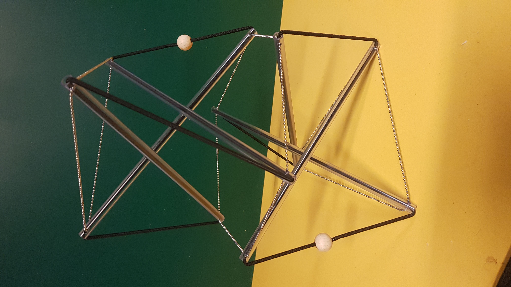

# Degrees of Freedom

* By shifting the elastic cord and moving the bars along the chains, you can choose a unique shape for today.
* Door het elastische koord te verschuiven en de staven langs de kettingen te verplaatsen, kun je een unieke vorm voor vandaag kiezen.
* Al cambiar el cordón elástico y mover las barras a lo largo de las cadenas, puede elegir una forma única para hoy.
* En déplaçant le cordon élastique et en déplaçant les barres le long des chaînes, vous pouvez choisir une forme unique pour aujourd'hui.

