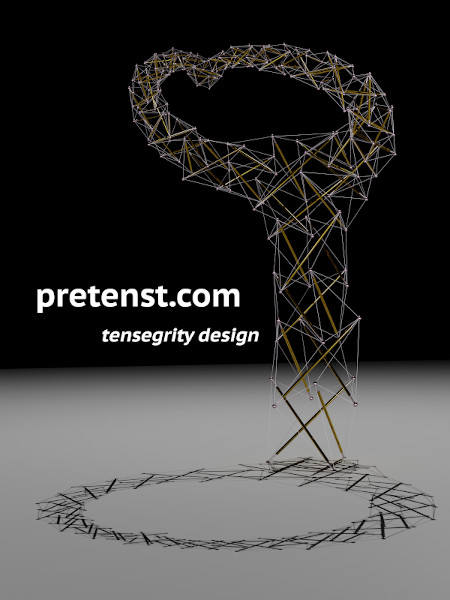
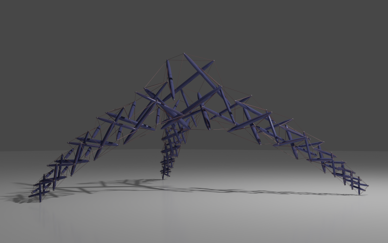
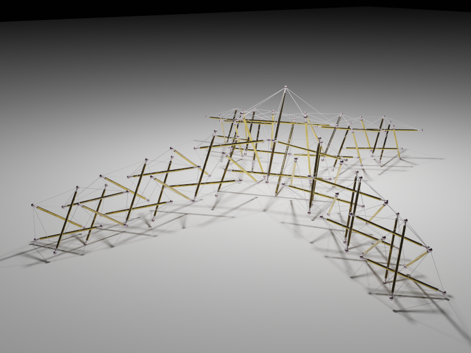
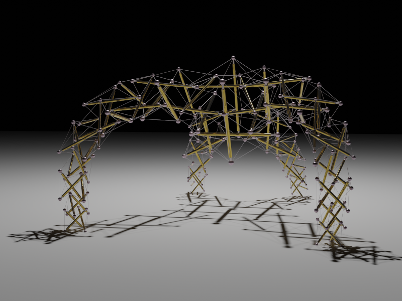
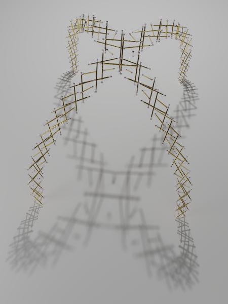
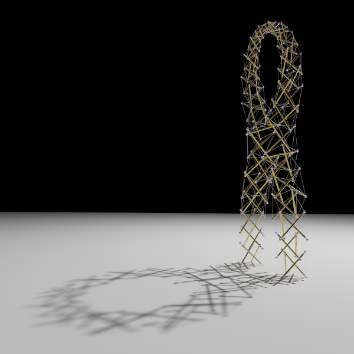
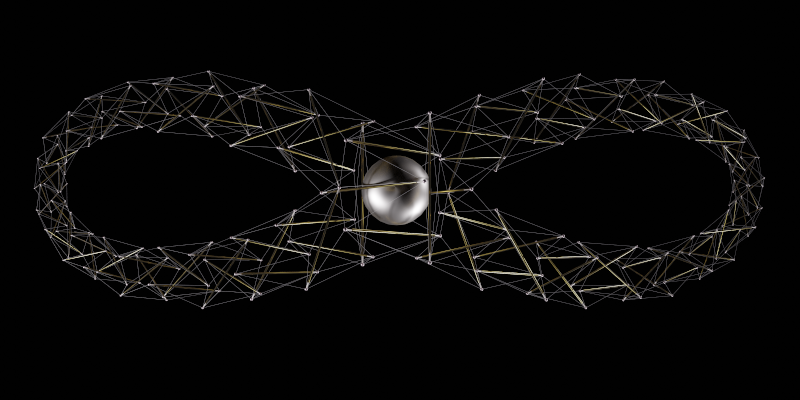
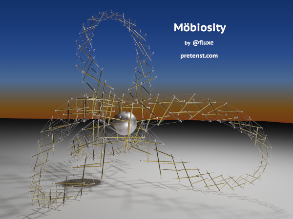

<link rel="stylesheet" href="https://cdn.jsdelivr.net/npm/glider-js@1/glider.min.css">

<link rel="shortcut icon" type="image/x-icon" href="favicon.ico">

# Gallery

These images were made by exporting model data from the pretenst [app](/app/) to [blender](https://www.blender.org/) for ray tracing.

Click on an image to see it in high-resolution.

  

    

    

    

    

    

    

    

    

    

    

    

    

    

    

    

    

    

  

  <button role="button" aria-label="Previous" class="glider-prev">«</button>
  <button role="button" aria-label="Next" class="glider-next">»</button>
  

