<link rel="stylesheet" href="https://cdn.jsdelivr.net/npm/glider-js@1/glider.min.css">

<link rel="shortcut icon" type="image/x-icon" href="favicon.ico">

# Pretenst Tensegrity Design

<iframe width="600" height="340" src="https://www.youtube.com/embed/SIyi6v5fbaA" frameborder="0" allow="accelerometer; autoplay; encrypted-media; gyroscope; picture-in-picture" allowfullscreen></iframe>

Pretenst software is tool for designing four-dimensional physical structures made from elements of pure compression (bars) and tension (cables) and exploring how they behave over time and under stress.

  

    
<a href="images/ray/a.jpg" target="_BLANK">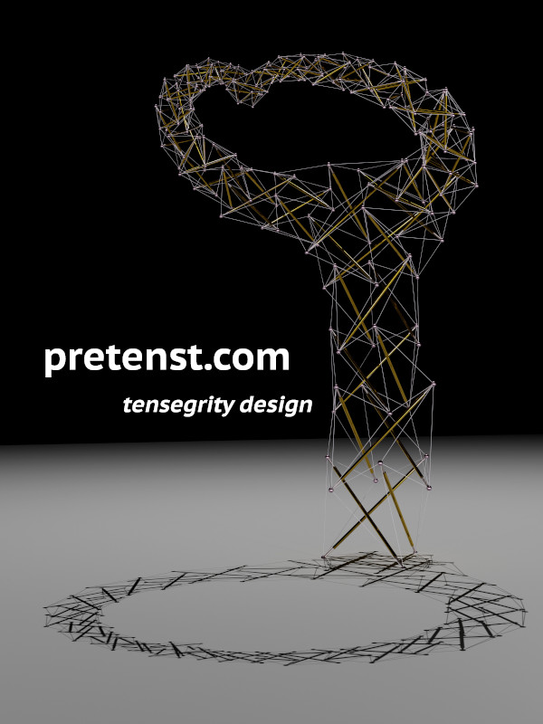</a>

    
<a href="images/ray/b.png" target="_BLANK">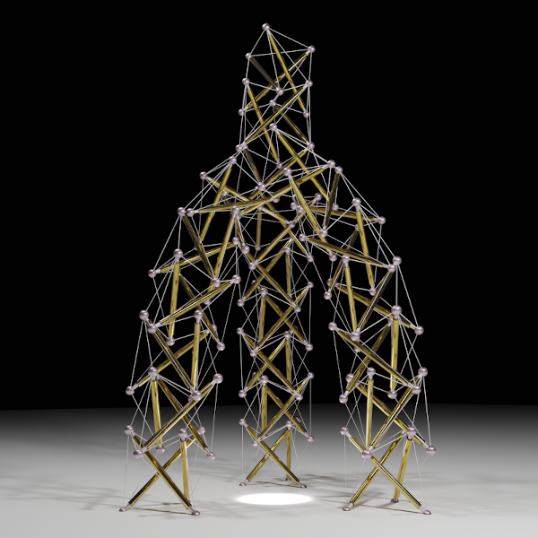</a>

    
<a href="images/ray/c.png" target="_BLANK">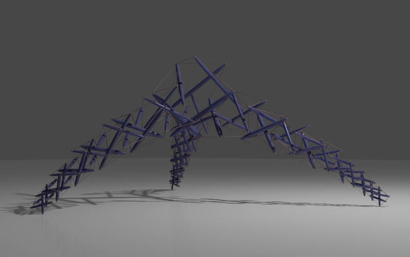</a>

    
<a href="images/ray/d.png" target="_BLANK">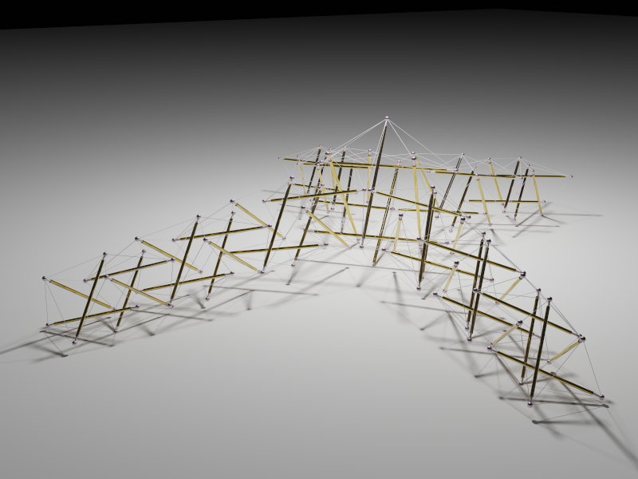</a>

    
<a href="images/ray/e.png" target="_BLANK">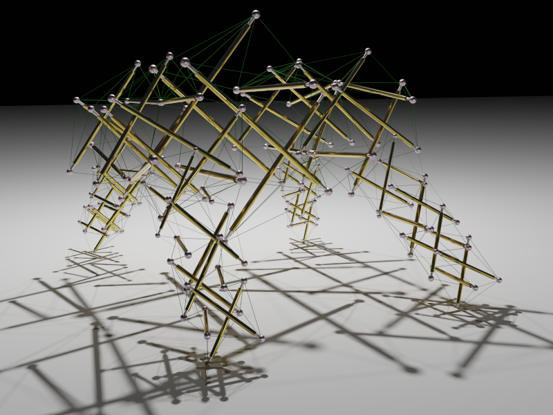</a>

    
<a href="images/ray/f.png" target="_BLANK">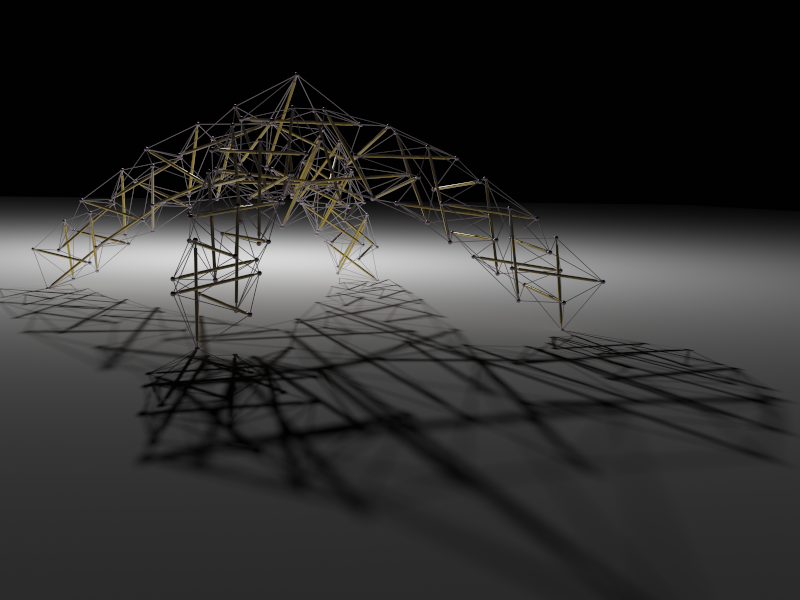</a>

    
<a href="images/ray/g.png" target="_BLANK">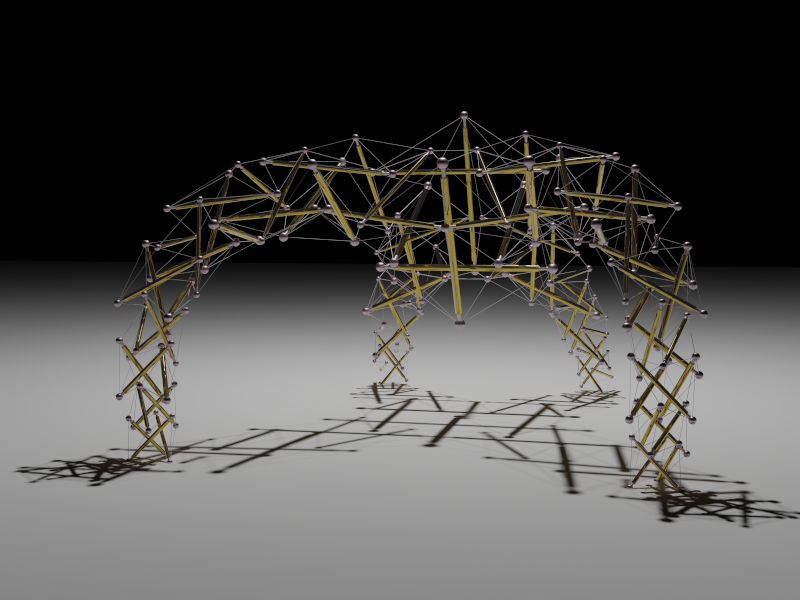</a>

    
<a href="images/ray/h.png" target="_BLANK">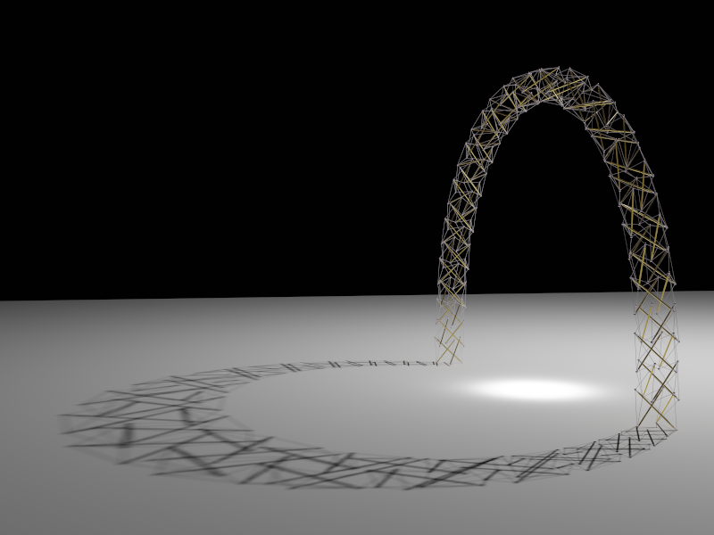</a>

    
<a href="images/ray/i.png" target="_BLANK">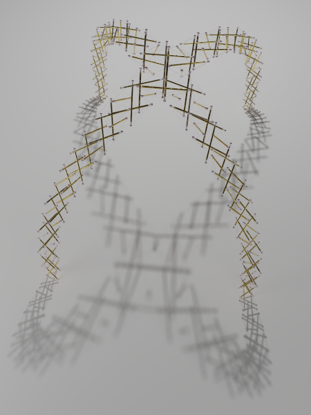</a>

    
<a href="images/ray/j.png" target="_BLANK">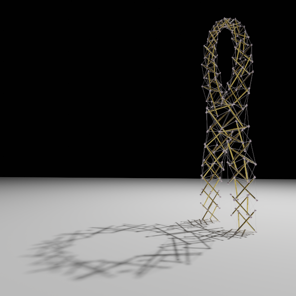</a>

    
<a href="images/ray/k.png" target="_BLANK">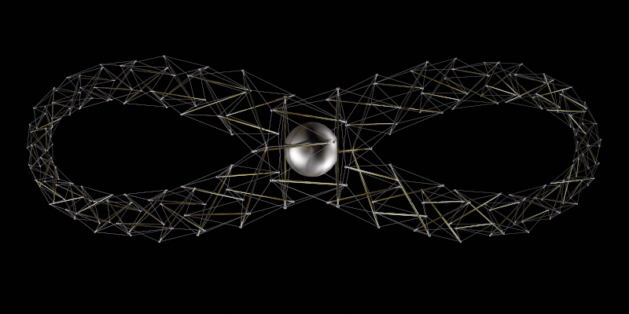</a>

    
<a href="images/ray/l.jpg" target="_BLANK">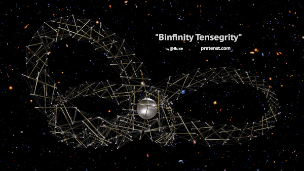</a>

    
<a href="images/ray/m.png" target="_BLANK">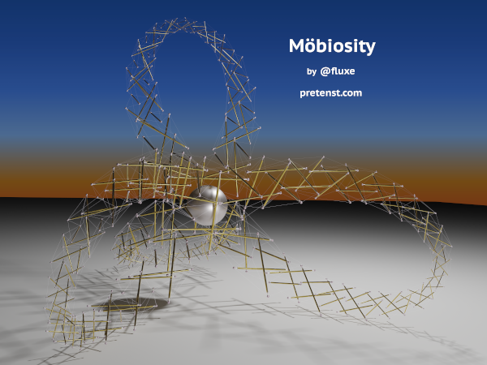</a>

    
<a href="images/ray/n.png" target="_BLANK">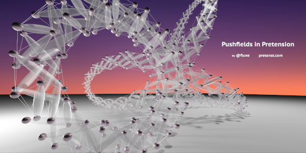</a>

    
<a href="images/ray/o.png" target="_BLANK">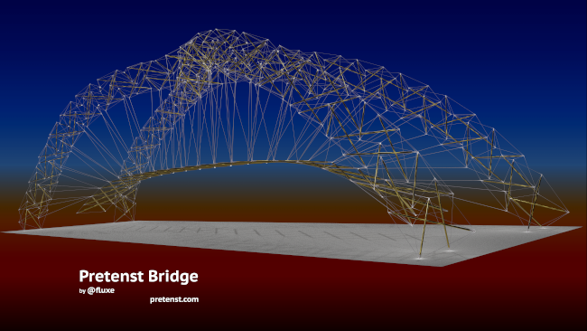</a>

  

  <button role="button" aria-label="Previous" class="glider-prev">«</button>
  <button role="button" aria-label="Next" class="glider-next">»</button>
  

## The Essence of Physical Structure

Pretenst structure, otherwise known as **tensegrity**, is minimalistic. It is structure distilled down to the basics of push and pull. It's because of this that these structures appear to be lighter than air, defying gravity, and that gives them their elegant beauty. The defining feature of tensegrity is that the pushing elements or bars are **floating**, separated from each other and only held together by a **network of tension**. The shape maintains its integrity because of the tension, and the compression pushing outwards is only localized.

## Contact

You can reach us by email at [**pretenst@gmail.com**](mailto:pretenst@gmail.com?subject=Pretenst%20Tensegrity%20Design) if you want to know more.

## Documentation

(work in progress...)

* [Process](process.md) - playful trial and error towards refinement and realization
* [Tenscript](tenscript.md) - a minimal language for generating pretenst structures
* [Physical](physical.md) - all about building things we can feel in our hands
* [Dynamic](dynamic.md) - when the structure starts to move

