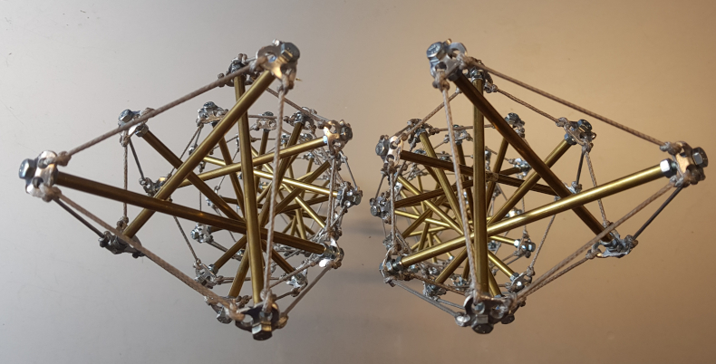

# What is it?

"Pretenst" structure, otherwise known as **tensegrity**, is structure which is distilled down to the basics of **push** and **pull**, making all of the forces visible. It is minimal, and as a result these structures appear to defy gravity, and that gives them their elegant beauty.

The defining feature of tensegrity is that the pushing elements or bars are **floating**, separated from each other and only held together by a **network of tension**. The shape maintains its integrity because of the tension, with or without gravity, since the compression pushing outwards is only localized.

This project is both about a piece of software, and about building real world tensegrity structures.

## Design Software

Pretenst software is an open source online tool for designing four-dimensional physical structures made from elements of pure compression (struts) and tension (cables) and exploring how they behave over time and under stress.

The app generates tensegrities based on a minimal language called "[tenscript](tenscript.md)". For example, the structure called "Halo by Crane" was generated with this short script: 

**L(5,S92,b(12,S92,MA1),d(11,S92,MA1))**

<iframe width="560" height="315" src="https://www.youtube.com/embed/hzGxoJWpRZs" frameborder="0" allow="accelerometer; autoplay; clipboard-write; encrypted-media; gyroscope; picture-in-picture" allowfullscreen></iframe>

With all the numbers from the generated virtual model, it became possible to [build](/construction/2020/10/26/halo-1) the real physical object!

{:height="700px"}

Scripts have also been written for importing structures into [Blender](https://www.blender.org/) for generating [high resolution renderings](gallery.md).

