# Tenscript

The foundation of our exploration of tensegrity is the ability to generate structures systematically. For this we have created **tenscript**, which is a minimal language describing how to grow and connect tensegrity structure. 

It's an extremely terse language, using a lot of brackets nesting things within other things, but that makes it very expressive.

## The Twist

The most basic building block is the twist, which has either a Left or Right spin. To see which spin, imagine curling the fingers of your hand the way that the blue bars are twisting making sure that your thumb points upwards.

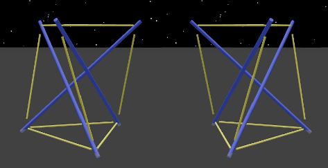

The tenscript to generate these two structures is the "zero" code, which means stop immediately.

    L() and R()

The lengths visualized here also intended show something about the strain on the elements. All elements appear as they "wish" to be. The bars appear slightly longer since they were longer before the cables tightened in on them. The cables appear slightly shorter because they were this short before they got stretched to hold on to the bars. Pretension is causing strain, and the strain is visualized with these length differences.

The colors here show the roles, where blue is pushing (bars) and yellow is pulling (cables). 

The top triangle face is named "A" and the bottom triangle is named "a". This will make more sense when you see the omnitwist below.

## Growing Columns

A tensegrity column can be built of multiple alternating twists stacked on top of each other and interconnected. To extend one twist upwards, this script creates a minimum column.

    L(1) and L(10)

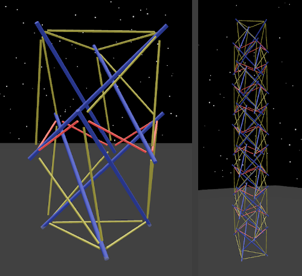

The twists start with L but go LRLRLR..., and you can see that a new kind of element has appeared, the ring cable, showing reddish. Ring cables form a hexagon that holds the two twists in place, and it is shorter than the other cables in yellow.

## The Omnitwist

Tenscript also uses the simplest symmetrical tensegrity unit, made with 6 compression bars and 8 triangles of tension, which we call the omnitwist. The lengths of its elements are derived from the classic irrational number, the Golden Ratio called "phi" or &phi; (1.61803398874989484820... to be more precise). When the 24 cables have length 1, the 6 bars have length &phi;.

An omnitwist actually consists of two twists, and it can either start with a left or right twist, so they are created using "RL" and "LR".

    RL() and LR()

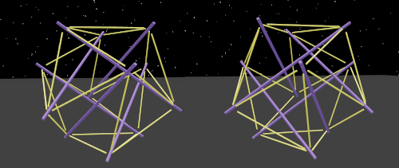

Each of the omnitwists's 8 triangles is given a name which allows us to specify exactly where to grow twists on top, and the names are arranged  according to their relationships, and the uppercase/lowercase of the names indicate a kind of polarity.

The top triangle is called "A" and the bottom triangle is called "a". The three triangles adjacent to "A" near the top are called "b", "c", and "d", and the bottom triangles adjacent to "a" are called "B", "C" and "D". Lowercase names are on the opposite side their uppercase counterparts, so "c" is opposite "C", and so on.

## Left-handed and Right-handed Faces

The omnitwist's faces are divided into two groups, the right-handed and left-handed ones. This comes from how the bars are angled where they touch the triangles of cables. To see how this works, pick a triangle face and observe how the bars "spin" towards it from the inside in one direction. If you have the curl of your fingers follow the spin and your thumb pointing outwards, only one of your hands will fit on each triangle.

Adjacent faces (sharing a joint) are always of opposite chirality. By convention, the uppercase names are right-handed and the lowercase ones are left-handed. The triangles adjacent to the right-handed "A", which are "b", "c", and "d" are left-handed just like "a". Whenever these special faces are used, the twist is promoted to become an omnitwist.

Whenever the special directions are used, the ones only present in the omnitwist, the twist using them is promoted to become an omnitwist.

## Branching

The following program will build a column and then branch off in the "b" direction with another column, effectively creating a kind of "knee": 

    L(3,b3)

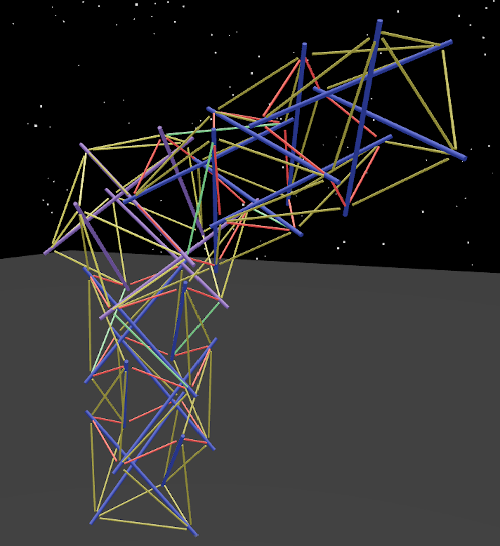

Just as easily, tenscript allows for branching in more than one direction at the same connection point, and when more than one branch is specified.

    L(1,b1,c1,d1)

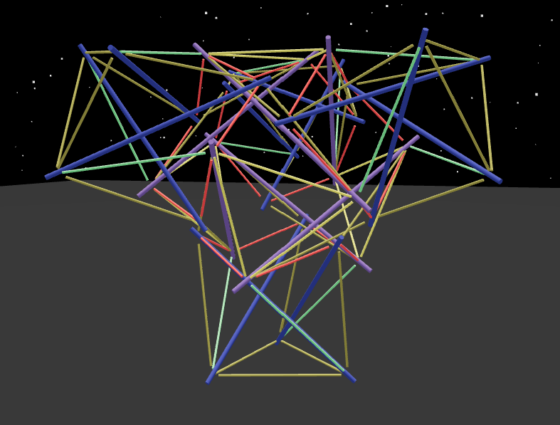

## Nesting

So far the programs we've looked at have just a single pair of brackets, but tenscript allows nesting or "recursion", so we can build much more complicated and interesting structures. When you see a letter-number combination in tenscript, it's actually shorthand for an expression leaving the brackets out, so:

    LR(d3,c7)
    LR(d3,c(7))
    LR(d3,c(7,b7)) adding a new branch in the "b" direction

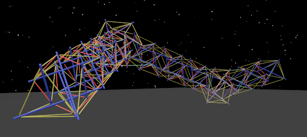

The instructions here is to start by adding three twists on top of the "A" triangle, turning in the "b" direction to build seven more, and then once again at the end of the second column branching in the "c" direction to build a third column.

If this is starting to look complicated, fasten your seatbelts, because once you have the ability to nest code inside of code, things get very weird indeed and we've just gotten started. As you may have guessed, we will be swimming in brackets.

For example, here is a program which keeps building like the one above, column after column, every time in exactly the right branch direction so that it eventually returns to almost where it started. It builds what we call a "zig-zag ring":

    LR(d3,c(7,b7))
    LR(d3,c(7,b(7,d7)))
    LR(d3,c(7,b(7,d(7,d7))))
    LR(d3,c(7,b(7,d(7,d(7,d7)))))
    LR(d3,c(7,b(7,d(7,d(7,d(7,d3))))))

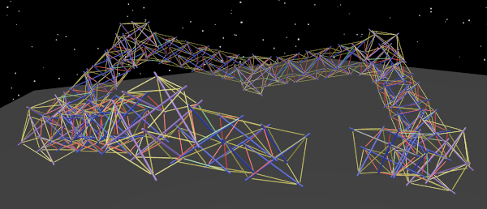

The first triangle face is however not connected to the last one so it doesn't actually complete the ring. For that we need another feature: marking.

## Mark to Connect

So far we have been able to grow new twists and branch in various directions, finally reaching the point of building a zig-zag ring where the first twist is very near the last twist, but we have only grown new twists and never connected existing twists together.

Tenscript has another feature to handle this which is the ability to **mark** the triangles of the twists or, in other words, to tag them with a number. The tenscript interpreter is set up to connect triangles which are tagged with the same number. Which number it is makes no difference at all, because it's just a tag.

Now this is not at all easy to think about, but we need this kind of thing to make connecting possible. Marking triangles is done by adding an item starting with the letter "M" for mark, then naming the triangle of the current twist which is to be marked, and then giving the mark number. So tagging the "b" triangle of the current twist with the number "8" would be done with "Mb8".

To illustrate this, it's easiest to see an unmarked program beside a marked program so here we mark triangles of the "zig-zag ring" mentioned above so that the ends of the C-shaped zig-zag are connected together. This way we can complete the ring!

    LR(d3,c(7,b(7,d(7,d(7,d(7,d3))))))
    LR(d(3),c(7,b(7,d(7,d(7,d(7,d(3)))))))
    LR(d(3,MA1),c(7,b(7,d(7,d(7,d(7,d(3,MA1)))))))

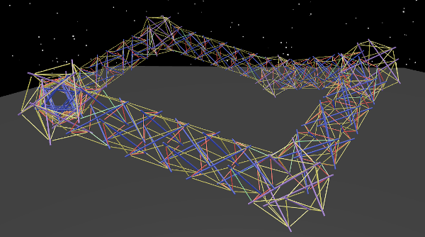

A face connection must always take place between a left-spin face and a right-spin face. If the two faces marked have the same spin, a new omnitwist is created in between and then the marked faces are brought together with appropriate faces of the omnitwist.

This can be seen in the "Convergence" example:

    'Convergence':LR(a1,b(15,S92,MA1),c(15,S92,MA1),d(15,S92,MA1))

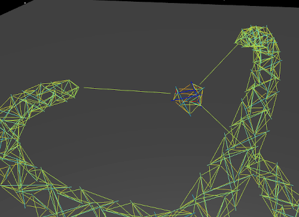

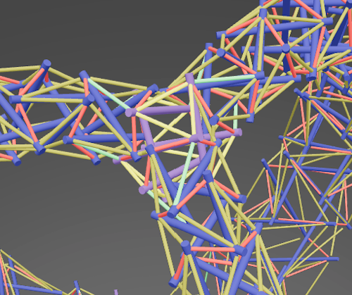

## Scaling

Historically, the initial trigger for creating this project was the first shocking encounter with the "Needle Tower" sculpture by Kenneth Snelson. It seemed to defy gravity and it also seemed to be taller than it actually ways. This sculpture starts large at ground level and then every section extending upwards becomes progressively smaller.

Tenscript has a feature which makes tensegrity columns follow this same pattern of diminishing size in the form of the "S" command which stands for "scale". The command takes a percentage as a parameter, and it applies to each twist in the column progressively, so "S99" builds a tower that tapers slightly, and "S101" builds one that gradually increases in size.

A thirty twist Snelson Needle Tower column turns out to be a tiny simple program which includes the scale command:

    L(30,S95)

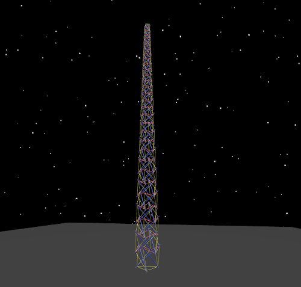

Combining scaling with branching and marking starts to give us some very pretty and interesting structures indeed, such as the "bulge ring":

    L(A(15,S90,MA1),a(16,S90,MA1))

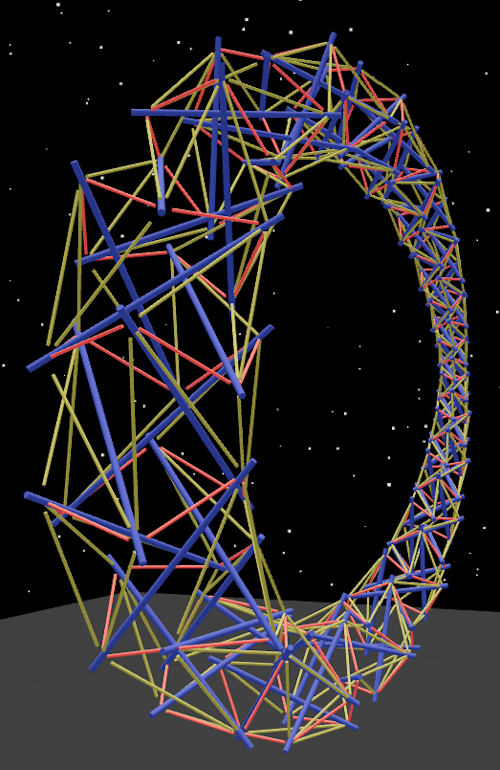

Here, there are two sixteen-twist tapering columns extending in opposite directions "A" and "a", which then have their end triangles marked so that the are drawn together and welded, resulting into a ring.

## Multiple Sections

Tenscript is encoded as a string of characters, and as you've seen, often with many brackets. The character string can be subdivided into sections using the colon character ":". For example, you can give a name by adding a section with quotes:

    'Axoneme':L(30,S95)

Other sections can be added as well, which allows for both composition and for specifying what the marks are to be used for. Other sections are therefore prefixed with "0=", "1=", "2=", etc which indicates the mark number.

## Composition with "subtree"

In tenscript, you can create subroutines and effectively compose construction programs using marks which substitute subtrees.

    'Composed':L(6,b(4,MA0),c(4,MA0),d(4,MA0)):0=subtree(b5,c5,d5)

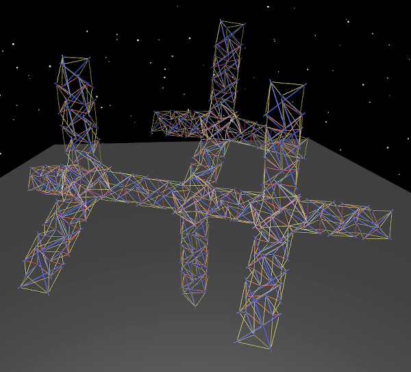

Here you can see that the 3-column fanout is defined in the subtree and built at the end of three different branches. This makes the whole program much shorter since there is less repetition.

## Face Distancing

Another feature which uses the special mark sections is "face-distance-N" which instructs the builder to create intervals between all of the marked faces and change them to "N %" of their original length.  So for example this program chooses the final faces on its three legs and pulls them until they are at a 35% distance from where they started.

    'Thick Tripod':LR(A3,B(8,MA1),C(8,MA1),D(8,MA1)):1=face-distance-35

As a result, the legs are pulled inwards so that the structure grows thinner and taller.

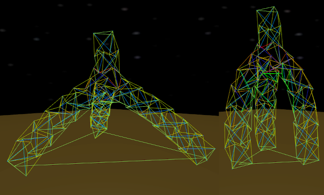

## Twists Beyond Three

It gets a little risky but the tenscript language even allows for experimenting with twists made up of more than three pushing elements. The number of pushes per twist can be passed on in the initial section before the first bracket.

    'Cup':L24(15,S105)

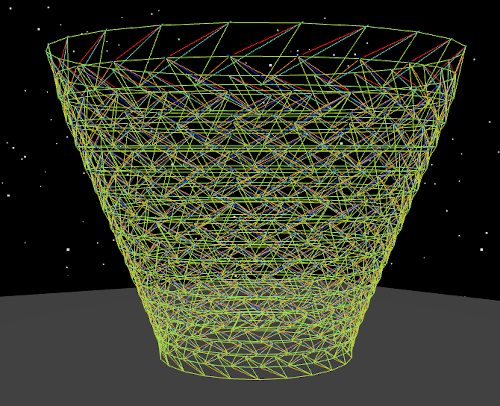

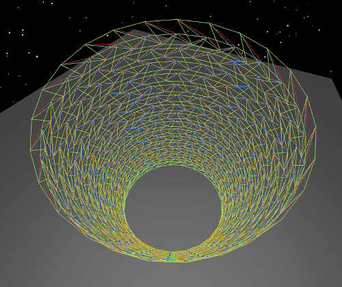

## What can it do?

The design space that can be explored with this minimal language is significant!

    'Equus Lunae':LR(A(16,S95,Mb0),b(16,S95,Md0),a(16,S95,Md0),B(16,Mb0,S95)):0=face-distance-60

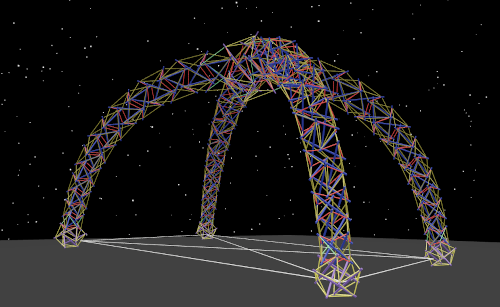

    'Infinity':LR(a(16,S90,MA1),b(16,S90,MA2),B(16,S90,MA1),A(16,S90,MA2))

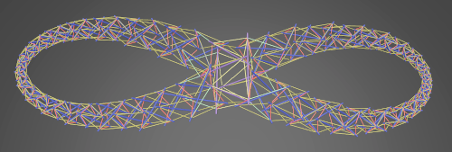

    'Mobiosity':LR(
        d(16,S90,MA4),C(16,S90,MA4),c(16,S90,MA3),
        D(16,S90,MA2),a(16,S90,MA1),b(16,S90,MA2),
        B(16,S90,MA1),A(16,S90,MA3)
    )

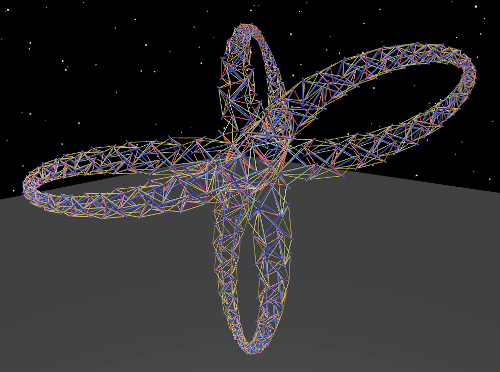

    'Diamond':RL(
        a(5,b(5,c(5,c(2,MA3)),d(5,b(2,MA4))),
        c(5,d(5,b(2,MA5)),c(5,c(2,MA1))),
        d(5,c(5,c(2,MA6)),d(5,b(2,MA2)))),
        b(5,b(5,d(2,MA3)),c(5,c(2,MA2))),
        c(5,b(5,d(2,MA6)),c(5,c(2,MA5))),
        d(5,c(5,c(2,MA4)),b(5,d(2,MA1)))
    )

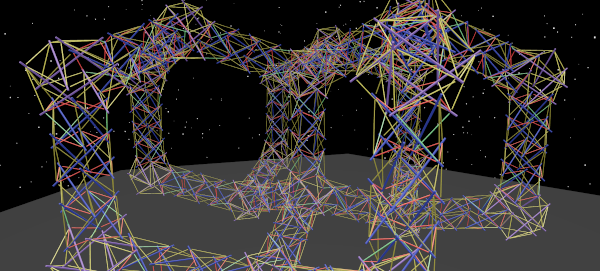

## Future work

From here it might make sense to expand the tenscript language, or since it's such a small language, perhaps it would be better to develop another parallel language that explores another way of generating. One thing that we're considering is somehow defining building blocks which start separated but join together on command. Let me know if you have any other ideas at **pretenst@gmail.com**
